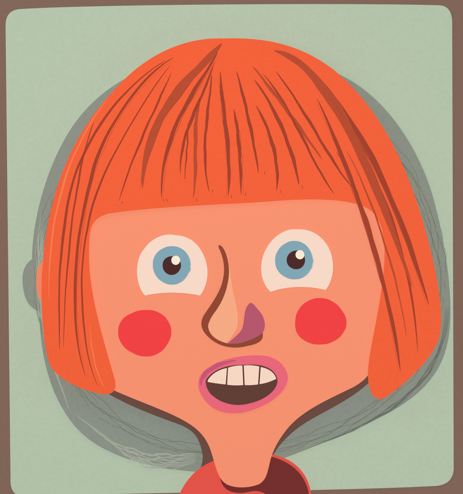

# Face Match Puzzle

A children's face-building puzzle game: look at the example character, then drag the eyes, nose, mouth
and hair onto a blank face to rebuild it. Inspired by magnetic face-puzzle toys.

- **Engine:** Godot 4 (2D) — iOS, Android, Web
- **Art:** Blender (scripted, `art/blender/`)
- **Design doc:** [`docs/GAME_DESIGN.md`](docs/GAME_DESIGN.md)

Status: pre-production.
