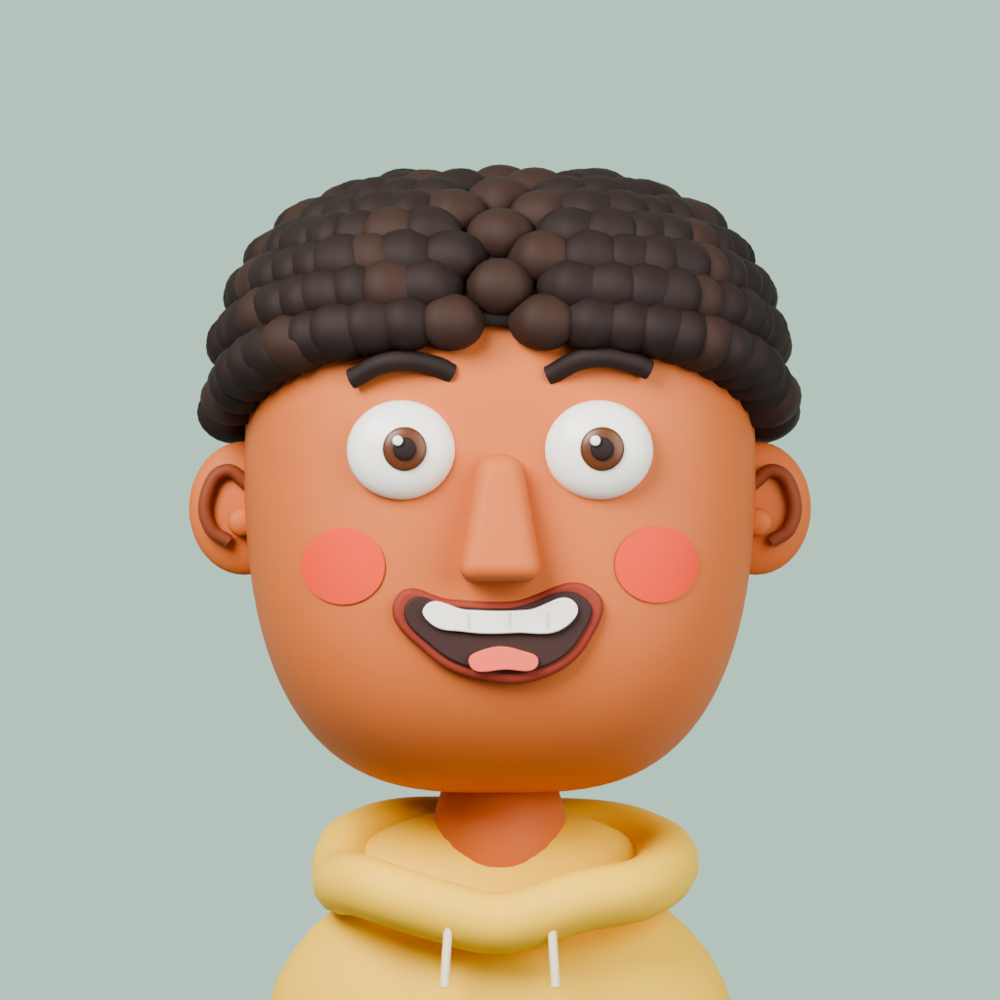
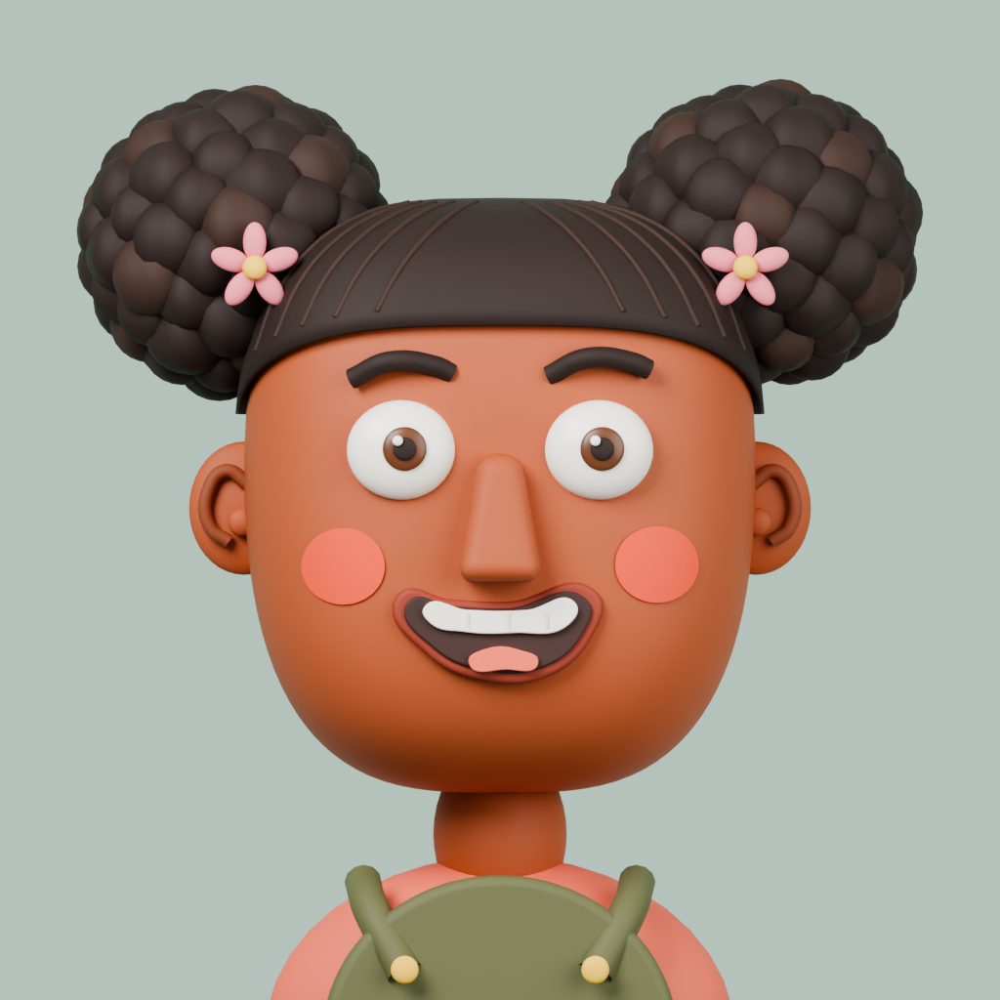

# Face Match Puzzle

A children's face-building puzzle game: look at the example character, then drag the eyes, nose, mouth
and hair onto a blank face to rebuild it. Inspired by magnetic face-puzzle toys.

| GBAM boy — short coils, yellow hoodie | GBAM girl — puff buns, green overalls |
|---|---|
|  |  |
| [Blank face](art/renders/gbam-boy-blank.png) | [Blank face](art/renders/gbam-girl-blank.png) |

- **Engine:** Godot 4 (2D) — iOS, Android, Web
- **Art:** Blender (scripted, `art/blender/`)
- **Design doc:** [`docs/GAME_DESIGN.md`](docs/GAME_DESIGN.md)

Status: pre-production. The two GBAM 3D portraits and blank bases are ready for design review;
individual game-piece exports and gameplay are not built yet. Earlier redhead/clown artwork is
preserved as history, not the launch style.
